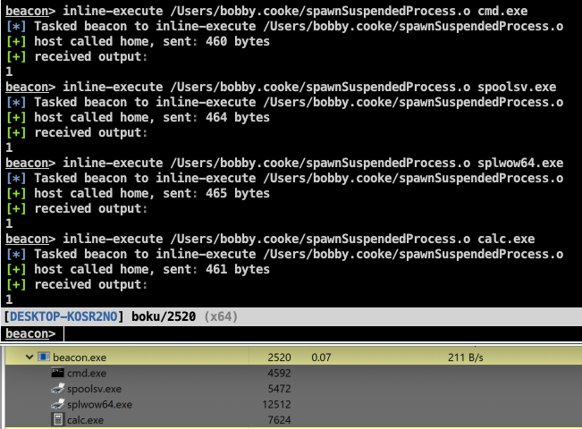

# bof-spawnSuspendedProcess
Cobalt Strike Beacon Object File (BOF) that takes the name of of a PE file as an argument and spawns the process in a suspended state

+ Spawning new suspended processes with the BOF
